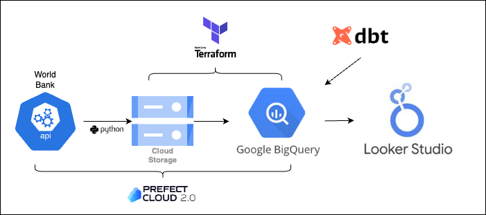
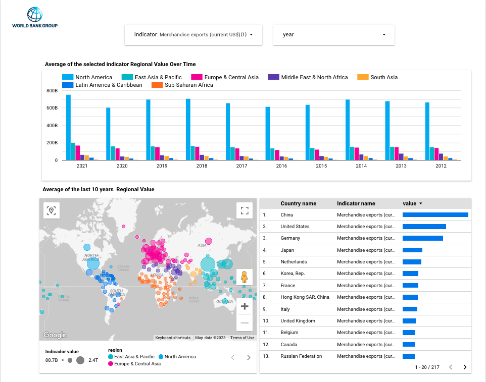

# World Bank KPI's

## Overview
The idea of this project is to provide an overview of macroeconomic trends across various countries based on a selection of World Bank indicators. The dashboard focuses on six indicators that are important drivers of economic growth: 

1. GDP growth (annual %) 
2. Merchandise exports (current US$) 
3. Unemployment, total (% of total labor force) (modeled ILO estimate)
4. Foreign direct investment, net inflows (BoP, current US$)
5. Labor force, total
6. Urban population (% of total population)


## Data Sources:
For this project I use the API `http://api.worldbank.org/v2/en/indicator/{indicator}?downloadformat=csv` where {`indicator`} correspond:
1. GDP growth (annual %) -> NY.GDP.MKTP.KD.ZG
2. Merchandise exports (current US$) -> TX.VAL.MRCH.CD.WT
3. Unemployment, total (% of total labor force) (modeled ILO estimate) -> SL.UEM.TOTL.ZS
4. Foreign direct investment, net inflows (BoP, current US$) -> BX.KLT.DINV.CD.WD
5. Labor force, total -> SL.TLF.TOTL.IN
6. Urban population (% of total population) -> SP.URB.TOTL.IN.ZS


## Tools & Tech Stack Used:
1. Infrastructure as Code(IaC) --> [Terraform](https://www.terraform.io)
2. Cloud Platform --> [Google Cloud](https://cloud.google.com)
3. Data Lake --> [Google Cloud Storage](https://cloud.google.com/storage/)
4. Data Warehouse --> [Google BigQuery](https://cloud.google.com/bigquery)
5. Data Transformation --> [dbt cloud](https://www.getdbt.com)
6. Workflow Orchestration --> [Prefect](https://app.prefect.cloud/auth/login)
7. Data Vizualization Tool --> [Google Data Studio](https://datastudio.google.com/)

## Data Pipeline Architecture:


## Dashboard


## Table Structure
- region: The name of the region for which the country is reported.
- country_name: The name of the country for which the indicator value is reported.
- country_code: The code assigned to the country by the ISO (International Organization for Standardization).
- ind_name: The name of the indicator as reported by the World Bank.
- ind_code: The code assigned to the indicator by the World Bank.
- year: The year for which the indicator value is reported.
- value: The value of the indicator for the given country, year, and indicator.


## Step-by-Step-Guide
1. Clone the repository
   
2. Create and activate a virtual enviroment.
   ```bash
    git clone <repository_url>
   ```
3. Install the packages required in the [requirements.txt](/requirements.txt) file.
   ```bash
      pip3 install -r requirements.txt  
   ```
4. Provisión Cloud Insfrastructure(Terraform)
   
   Go to [Local Setup for Terraform and GCP](/terraform/README.md) and configure GCP & Terraform.
   **Important:** do not forget to download service-account-keys (.json) for auth and saved it in the *root* of your project with the `service_account_keys.json` file name.

5. Orchestration - Extraction & Load (Prefect)
   Configure and execute [prefect](/prefect/README.md) to:
   - Donwload files from website to google cloud storage
   - Load data to BigQuery

6. Transformations (DBT)
   Configure [dbt cloud](/dbt/README.md) project to run transformation process.

7. Visualitation(Looker Studio)
   To see the dashboard clic [here](https://lookerstudio.google.com/reporting/52708787-839a-4a76-861e-39b55b2a1f86).
   
    
   
   
   


